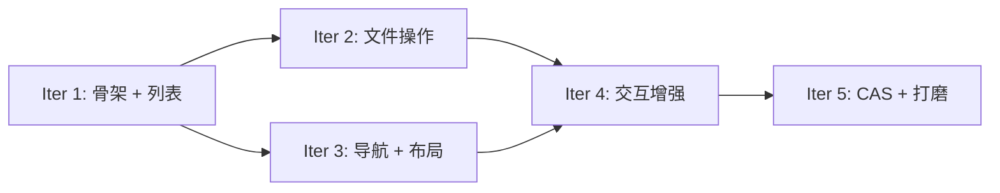

# CASFA Explorer — 迭代计划

## 总览

基于 [需求文档](../requirements.md) 规划 5 个迭代，每个迭代约 1 周，可独立交付可运行版本。

```
Iter 1 ──► Iter 2 ──► Iter 3 ──► Iter 4 ──► Iter 5
骨架+列表   文件操作    导航+布局   交互增强    CAS+打磨
```

## 迭代依赖关系



## 各迭代概要

| 迭代 | 主题 | 交付物 | 用例覆盖 |
|------|------|--------|---------|
| [Iter 1](./iter-1-skeleton.md) | **骨架 + 列表浏览** | 包脚手架、client `fs.*` 方法、core store、List view、面包屑、depot 选择器 | B-1, B-3, B-4, C-3.5 |
| [Iter 2](./iter-2-file-ops.md) | **文件操作** | 上传、创建文件夹、删除、重命名、右键菜单、权限感知、错误处理 | W-1~W-8, S-4, P-1, P-5, U-1~U-4 |
| [Iter 3](./iter-3-nav-layout.md) | **导航 + 布局** | 树形侧边栏、Grid view、前进/后退、路径输入、搜索、列排序 | B-2, B-5~B-10, S-1~S-3 |
| [Iter 4](./iter-4-interaction.md) | **交互增强** | 剪贴板（复制/移动）、拖拽（DnD）、键盘快捷键、Detail/Preview 面板、上传进度 | W-3, W-4, W-9, W-10, S-5~S-7, R-1~R-4 |
| [Iter 5](./iter-5-cas-polish.md) | **CAS 特性 + 打磨** | CAS URI/Hash、depot 历史、批量 rewrite、i18n、暗色模式、响应式、headless hooks | C-1~C-6, W-11, U-5~U-9 |

---

## 迭代完成清单

### Iter 1 — 骨架 + 列表浏览

- [x] 包脚手架 (`packages/explorer/`, `package.json`, `tsconfig.json`, `tsup.config.ts`)
- [x] `types.ts` — `ExplorerItem`, `PathSegment`, `CasfaExplorerProps`, `ExplorerT` 等公共类型
- [x] `explorer-store.ts` — Zustand store: depot 选择、目录浏览、分页、布局切换
- [x] `use-explorer-context.ts` — `ExplorerStoreContext` + `ExplorerI18nContext`
- [x] `<CasfaExplorer>` — 顶层组件，创建 store 和 i18n
- [x] `<ExplorerShell>` — Depot 选择 ↔ 文件浏览切换
- [x] `<ExplorerToolbar>` — 面包屑 + 刷新按钮
- [x] `<FileList>` — 列表视图 + IntersectionObserver 分页
- [x] `<Breadcrumb>` — 路径导航
- [x] `<DepotSelector>` — Depot 列表卡片 + 搜索
- [x] `<StatusBar>` — 底部状态栏
- [x] i18n: `en-US.ts`, `zh-CN.ts`

### Iter 2 — 文件操作

- [x] 2.1 Toolbar 上传按钮 + hidden `<input type="file" multiple>`
- [x] 2.2 `<UploadOverlay>` 拖拽上传覆盖层（ref 计数器防嵌套误触）
- [x] 2.3 `<UploadProgress>` 上传队列面板（取消 / 重试 / 折叠）
- [x] 2.4 `<CreateFolderDialog>` 新建文件夹（名称校验：空 / 非法字符 / 重名）
- [x] 2.5 `<ConfirmDialog>` 通用确认对话框 + 单个/批量删除
- [x] 2.6 `<RenameDialog>` 重命名（预填名称 + 智能选中文件名不含扩展名）
- [x] 2.7 `<ContextMenu>` 右键菜单（文件 / 文件夹 / 空白区域三套，剪切/复制/粘贴 disabled 留待 Iter 4）
- [x] 2.8 权限感知 — `permissions: { canUpload, canManageDepot }`，403 动态降级
- [x] 2.9 Store 扩展 — `uploadQueue`, `selectedItems`, `operationLoading`, `dialogState`, `lastError`
- [x] 2.10 `<ErrorSnackbar>` 全局错误提示（按类型区分 severity，5s 自动消失）
- [x] 2.11 `extraContextMenuItems` 扩展点
- [x] 2.12 `extraToolbarItems` 扩展点
- [x] `<FileList>` 多选支持（Checkbox + Ctrl/Cmd+Click）
- [x] `<StatusBar>` 显示选中数量
- [x] `use-upload.ts` hook（文件大小校验 ≤4MB + 队列消费）
- [x] i18n 扩展：上传进度、权限、删除结果、校验相关文案
- [x] 键盘快捷键：Delete 删除、F2 重命名
- [x] TypeScript 编译通过，build 成功

### Iter 3 — 导航 + 布局

- [ ] 树形侧边栏
- [ ] Grid view
- [ ] 前进/后退导航
- [ ] 路径输入框
- [ ] 搜索
- [ ] 列排序

### Iter 4 — 交互增强

- [ ] 剪贴板（复制/剪切/粘贴）
- [ ] 拖拽（DnD）
- [ ] 键盘快捷键完善
- [ ] Detail/Preview 面板
- [ ] 上传进度增强

### Iter 5 — CAS 特性 + 打磨

- [ ] CAS URI / Hash 展示
- [ ] Depot 历史
- [ ] 批量 rewrite
- [ ] i18n 完善
- [ ] 暗色模式
- [ ] 响应式布局
- [ ] Headless hooks

## 迭代节奏

- **每迭代开始**: 简短 kick-off，确认 scope
- **每迭代中期**: 代码 review + 可运行 demo
- **每迭代结束**: 合入 main、更新 CHANGELOG、demo 截图/录屏
- **每迭代回顾**: 评估 scope 是否需调整，未完成项顺延到下一迭代

## Definition of Done（DoD）

每个迭代的功能需满足：

1. TypeScript 编译通过，无 `any` 逃逸
2. 核心逻辑有单元测试
3. 组件可在 `apps/server/frontend` 中集成验证
4. 无 console error/warning
5. 基本键盘可访问
