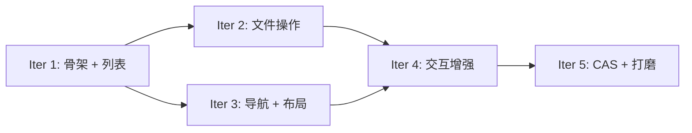

# CASFA Explorer — 迭代计划

## 总览

基于 [需求文档](../requirements.md) 规划 5 个迭代，每个迭代约 1 周，可独立交付可运行版本。

```
Iter 1 ──► Iter 2 ──► Iter 3 ──► Iter 4 ──► Iter 5
骨架+列表   文件操作    导航+布局   交互增强    CAS+打磨
```

## 迭代依赖关系



## 各迭代概要

| 迭代 | 主题 | 交付物 | 用例覆盖 |
|------|------|--------|---------|
| [Iter 1](./iter-1-skeleton.md) | **骨架 + 列表浏览** | 包脚手架、client `fs.*` 方法、core store、List view、面包屑、depot 选择器 | B-1, B-3, B-4, C-3.5 |
| [Iter 2](./iter-2-file-ops.md) | **文件操作** | 上传、创建文件夹、删除、重命名、右键菜单、权限感知、错误处理 | W-1~W-8, S-4, P-1, P-5, U-1~U-4 |
| [Iter 3](./iter-3-nav-layout.md) | **导航 + 布局** | 树形侧边栏、Grid view、前进/后退、路径输入、搜索、列排序 | B-2, B-5~B-10, S-1~S-3 |
| [Iter 4](./iter-4-interaction.md) | **交互增强** | 剪贴板（复制/移动）、拖拽（DnD）、键盘快捷键、Detail/Preview 面板、上传进度 | W-3, W-4, W-9, W-10, S-5~S-7, R-1~R-4 |
| [Iter 5](./iter-5-cas-polish.md) | **CAS 特性 + 打磨** | CAS URI/Hash、depot 历史、批量 rewrite、i18n、暗色模式、响应式、headless hooks | C-1~C-6, W-11, U-5~U-9 |

## 迭代节奏

- **每迭代开始**: 简短 kick-off，确认 scope
- **每迭代中期**: 代码 review + 可运行 demo
- **每迭代结束**: 合入 main、更新 CHANGELOG、demo 截图/录屏
- **每迭代回顾**: 评估 scope 是否需调整，未完成项顺延到下一迭代

## Definition of Done（DoD）

每个迭代的功能需满足：

1. TypeScript 编译通过，无 `any` 逃逸
2. 核心逻辑有单元测试
3. 组件可在 `apps/server/frontend` 中集成验证
4. 无 console error/warning
5. 基本键盘可访问
