# CASFA 模块化设计与依赖关系

CASFA（Content-Addressable Storage for Agents）采用 monorepo 架构，通过分层模块化设计实现关注点分离。所有包通过 `workspace:*` 协议互相引用，由包管理器（Bun）统一管理。

## 依赖关系图

```mermaid
graph TB
    subgraph Apps["🚀 Apps"]
        direction TB
        CLI["@casfa/cli<br/><i>CLI tool</i>"]
        SERVER["@casfa/server<br/><i>Server (private)</i>"]
    end

    subgraph Foundation["🧱 Foundation Layer"]
        direction TB
        PROTOCOL["@casfa/protocol<br/><i>API schemas & types</i>"]
        STORAGE_CORE["@casfa/storage-core<br/><i>Storage abstractions</i>"]
        CAS_URI["@casfa/cas-uri<br/><i>CAS URI parsing</i>"]
        DELEGATE["@casfa/delegate<br/><i>Delegate types</i>"]
        PROOF["@casfa/proof<br/><i>Proof header utils</i>"]
    end

    subgraph Core["⚙️ Core Layer"]
        direction TB
        CORE["@casfa/core<br/><i>B-Tree encoding</i>"]
        FS["@casfa/fs<br/><i>Filesystem ops</i>"]
        DELEGATE_TOKEN["@casfa/delegate-token<br/><i>Token encoding</i>"]
        CLIENT_AUTH["@casfa/client-auth-crypto<br/><i>Auth cryptography</i>"]
    end

    subgraph Client_Layer["📦 Client Layer"]
        direction TB
        CLIENT["@casfa/client<br/><i>Client library</i>"]
        EXPLORER["@casfa/explorer<br/><i>File explorer UI</i>"]
    end

    subgraph Storage["💾 Storage Providers"]
        direction TB
        STORAGE_FS["@casfa/storage-fs<br/><i>File system</i>"]
        STORAGE_MEMORY["@casfa/storage-memory<br/><i>In-memory</i>"]
        STORAGE_S3["@casfa/storage-s3<br/><i>S3</i>"]
        STORAGE_HTTP["@casfa/storage-http<br/><i>HTTP</i>"]
        STORAGE_CACHED["@casfa/storage-cached<br/><i>Cache layer</i>"]
        STORAGE_IDB["@casfa/storage-indexeddb<br/><i>IndexedDB</i>"]
    end

    %% Foundation → Core
    CORE --> STORAGE_CORE
    FS --> CORE
    FS --> PROTOCOL
    DELEGATE_TOKEN --> PROTOCOL
    CLIENT_AUTH --> PROTOCOL

    %% Core → Client
    CLIENT --> CAS_URI
    CLIENT --> CLIENT_AUTH
    CLIENT --> DELEGATE_TOKEN
    CLIENT --> PROTOCOL
    CLIENT -.->|peer| STORAGE_CORE

    %% Explorer peer deps
    EXPLORER -.->|peer| CLIENT
    EXPLORER -.->|peer| CORE
    EXPLORER -.->|peer| FS
    EXPLORER -.->|peer| PROTOCOL

    %% Storage providers
    STORAGE_FS --> STORAGE_CORE
    STORAGE_MEMORY --> STORAGE_CORE
    STORAGE_S3 --> STORAGE_CORE
    STORAGE_CACHED --> STORAGE_CORE
    STORAGE_HTTP --> STORAGE_CORE
    STORAGE_HTTP --> CLIENT
    STORAGE_HTTP --> PROTOCOL
    STORAGE_HTTP --> PROOF
    STORAGE_IDB --> STORAGE_CACHED
    STORAGE_IDB --> STORAGE_CORE

    %% Apps
    CLI --> CLIENT
    CLI --> CORE
    CLI --> PROTOCOL

    SERVER --> CLIENT
    SERVER --> CORE
    SERVER --> FS
    SERVER --> DELEGATE
    SERVER --> DELEGATE_TOKEN
    SERVER --> PROOF
    SERVER --> PROTOCOL
    SERVER --> EXPLORER
    SERVER --> STORAGE_CORE
    SERVER --> STORAGE_FS
    SERVER --> STORAGE_HTTP
    SERVER --> STORAGE_IDB
    SERVER --> STORAGE_MEMORY
    SERVER --> STORAGE_S3

    %% Styling
    classDef foundation fill:#e8f5e9,stroke:#2e7d32,color:#1b5e20
    classDef core fill:#e3f2fd,stroke:#1565c0,color:#0d47a1
    classDef client fill:#fff3e0,stroke:#e65100,color:#bf360c
    classDef storage fill:#f3e5f5,stroke:#6a1b9a,color:#4a148c
    classDef app fill:#fce4ec,stroke:#c62828,color:#b71c1c

    class PROTOCOL,STORAGE_CORE,CAS_URI,DELEGATE,PROOF foundation
    class CORE,FS,DELEGATE_TOKEN,CLIENT_AUTH core
    class CLIENT,EXPLORER client
    class STORAGE_FS,STORAGE_MEMORY,STORAGE_S3,STORAGE_HTTP,STORAGE_CACHED,STORAGE_IDB storage
    class CLI,SERVER app
```

> **图例：** 实线箭头 `→` 表示直接依赖（dependencies），虚线箭头 `-.->` 表示 peer 依赖。箭头方向为 "依赖于"。

---

## 分层架构

项目按职责分为 **四层**，依赖方向严格从上到下，不存在循环依赖。

### 1. Foundation Layer（基础层）

零内部依赖的叶子包，提供全局共享的类型定义、协议规约和基础抽象。

| 包 | 说明 |
|---|------|
| `@casfa/protocol` | API 协议定义 — Zod schema、请求/响应类型、路由常量。所有涉及 API 交互的包都依赖它 |
| `@casfa/storage-core` | 存储提供者的核心接口（`StorageProvider`、`HashProvider`）和通用工具函数 |
| `@casfa/cas-uri` | CAS URI 的解析与格式化，如 `cas://hash/path` |
| `@casfa/delegate` | Delegate 实体类型定义与纯验证函数，用于授权系统 |
| `@casfa/proof` | `X-CAS-Proof` 请求头的解析、验证与格式化 |

### 2. Core Layer（核心层）

在基础层之上构建核心业务逻辑。

| 包 | 依赖 | 说明 |
|---|------|------|
| `@casfa/core` | `storage-core` | CAS 二进制格式编解码 — 自相似 B-Tree 节点结构 |
| `@casfa/fs` | `core`, `protocol` | 基于 StorageProvider + HashProvider 的 CAS 文件系统操作 |
| `@casfa/delegate-token` | `protocol` | Delegate Token 的编解码 |
| `@casfa/client-auth-crypto` | `protocol` | 客户端认证加密（PKCE、加密、显示码） |

### 3. Client Layer（客户端层）

面向使用者的高级 API 和 UI 组件。

| 包 | 依赖 | 说明 |
|---|------|------|
| `@casfa/client` | `cas-uri`, `client-auth-crypto`, `delegate-token`, `protocol`; peer: `storage-core` | 统一授权策略的 CASFA 客户端库 |
| `@casfa/explorer` | peer: `client`, `core`, `fs`, `protocol` | CASFA 文件浏览器 React 组件 |

### 4. Storage Providers（存储提供者）

`StorageProvider` 接口的不同实现，通过策略模式支持多种存储后端。

| 包 | 依赖 | 说明 |
|---|------|------|
| `@casfa/storage-fs` | `storage-core` | 本地文件系统存储 |
| `@casfa/storage-memory` | `storage-core` | 内存存储（用于测试） |
| `@casfa/storage-s3` | `storage-core` | AWS S3 存储 |
| `@casfa/storage-cached` | `storage-core` | 缓存装饰器 — 在远程后端上叠加本地缓存 |
| `@casfa/storage-indexeddb` | `storage-cached`, `storage-core` | 浏览器 IndexedDB 存储（通过 cached 层） |
| `@casfa/storage-http` | `storage-core`, `client`, `protocol`, `proof` | HTTP 存储 — 将 CASFA API 封装为 StorageProvider |

---

## 应用（Apps）

| 应用 | 依赖 | 说明 |
|------|------|------|
| `@casfa/cli` | `client`, `core`, `protocol` | 命令行工具，用于与 CASFA 服务交互 |
| `@casfa/server` | 几乎所有包 | 服务端，包含 Hono API 后端 + React 前端管理界面，部署到 AWS Lambda |

---

## 设计原则

1. **单向依赖** — 依赖方向严格从上层到下层，杜绝循环依赖
2. **接口隔离** — `storage-core` 只定义抽象接口，具体实现按环境拆分为独立包
3. **协议共享** — `protocol` 包作为 API 契约的唯一事实来源（Single Source of Truth），前后端共用
4. **Peer 依赖** — UI 组件（`explorer`）使用 peerDependencies 避免重复打包，由宿主应用提供实例
5. **可替换存储** — 通过策略模式，存储后端可在文件系统、S3、IndexedDB、内存等之间自由切换
6. **渐进式复杂度** — 叶子包无内部依赖，新开发者可从基础层开始理解系统
